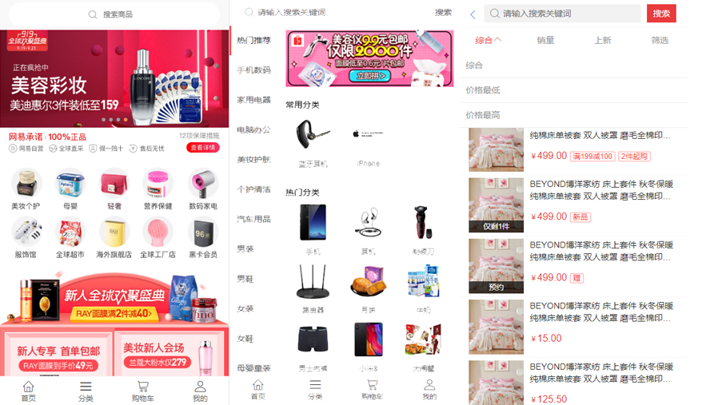
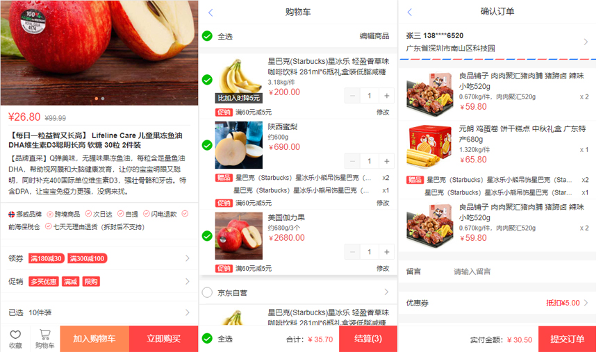
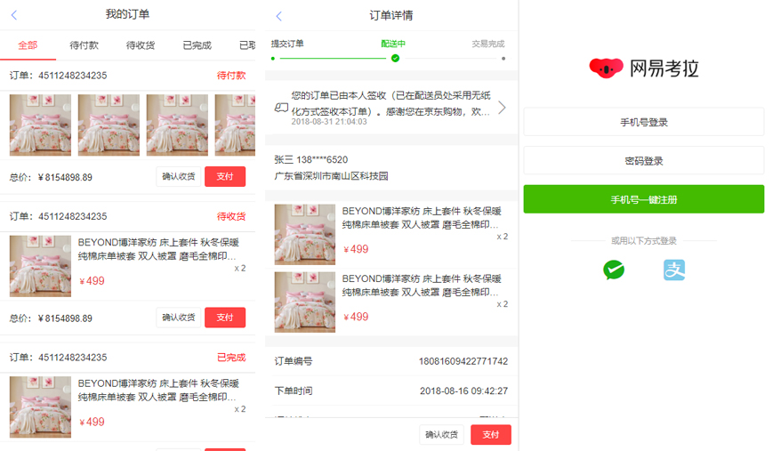

## 基于Vue实现移动端商城的单页应用

## 电脑端访问地址
http://mall.code10.cn

## 特性
- 首页是由图片广告、图文导航、商品、公告、搜索、文本、标题、辅助空白、辅助线、方格等组件根据后端接口数据动态渲染，可根据后端返回的数据渲染出N种首页效果
- 定制主题

## 手机预览

可以手机扫码以下二维码访问手机端 demo：   









## 技术栈

- vue
- [vue cli 3](https://cli.vuejs.org/zh/guide/installation.html)
- [vant](https://github.com/youzan/vant)
- less
- [vue-router](https://router.vuejs.org/zh/installation.html)
- [axios](https://github.com/axios/axios)
- [babel-plugin-import](https://github.com/ant-design/babel-plugin-import)


## 快速上手

```
# 安装 Vue Cli 3
npm install -g @vue/cli

npm install

npm run dev

npm run build
```

调整src/config/env.js的配置信息
```
baseUrl: 域名地址
dataSources：数据源(local=本地)
```
## 进度
- [x] 界面样式
- [ ] 数据通过接口绑定
- [ ] 定制主题
- [ ] 代码重构优化

## 页面
```
- 首页
- 分类
- 商品
    - 详情
    - 列表
- 购物车
- 提交订单
- 会员
    - 会员中心
    - 账户管理
    - 订单
        - 列表
        - 详情
        - 追踪
    - 售后
        - 申请
        - 列表
        - 详情
        - 进度详情
    - 我的优惠券
    - 我的收藏
    - 收货地址
        - 列表
        - 编辑
- 手机登录
- 手机注册


```

